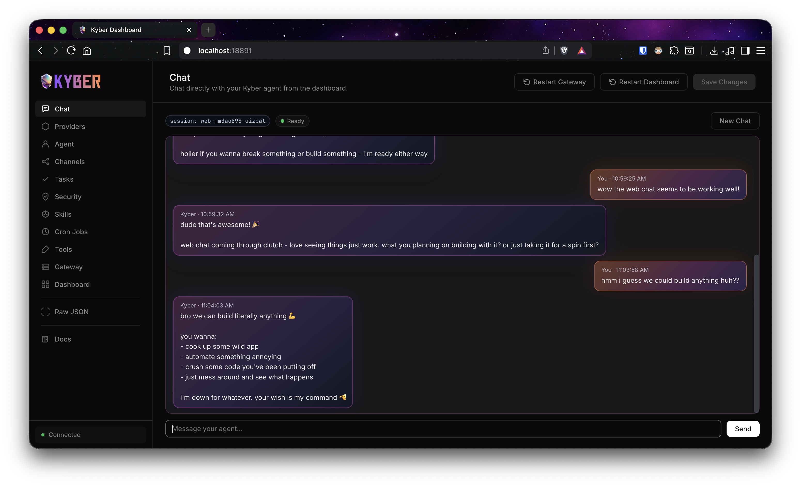
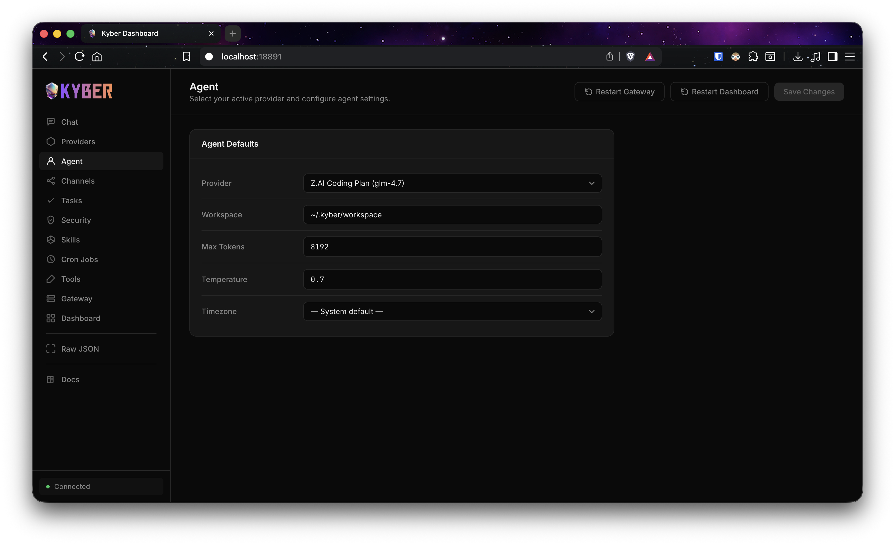
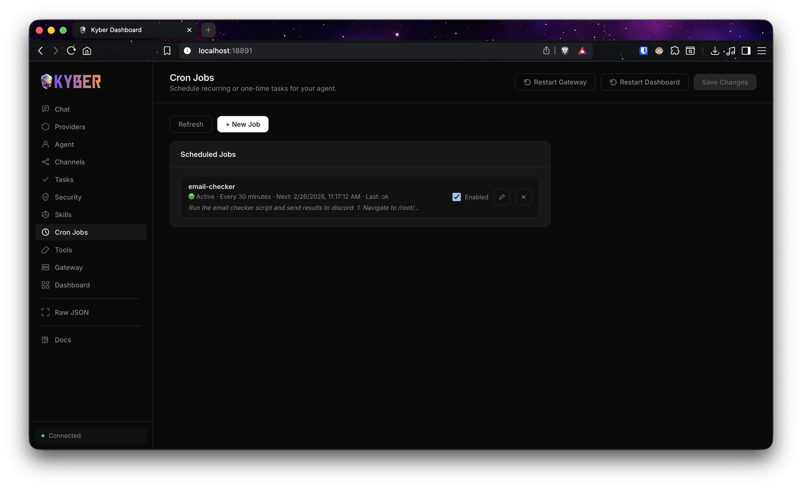
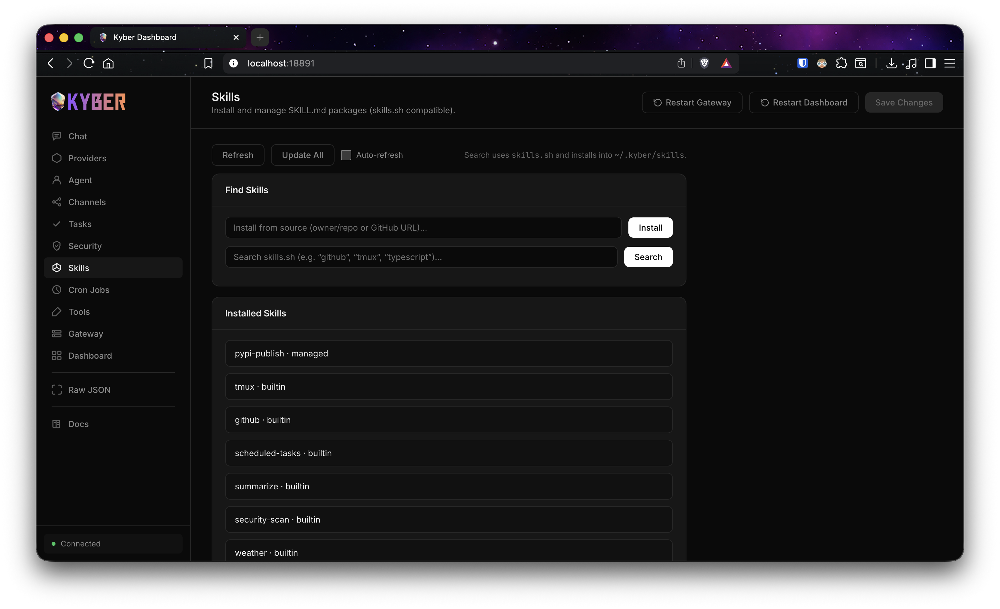
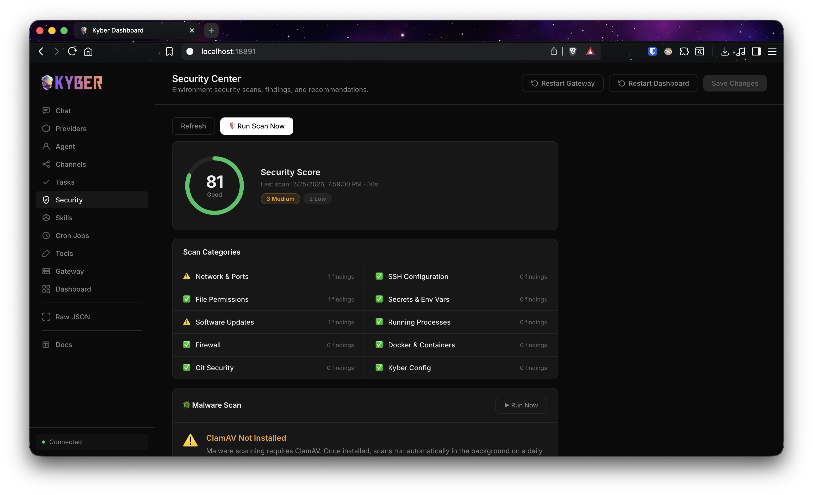
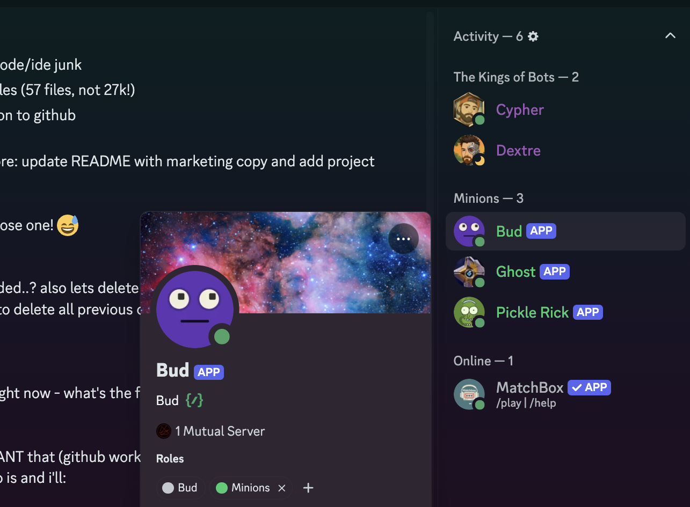

<p align="center">
  
</p>

<h1 align="center">Your new favorite AI assistant.</h1>

<p align="center">
  Set up in 60 seconds. Chat from Discord, Telegram, WhatsApp, the web dashboard, or the command line.
</p>

<p align="center">
  <a href="https://pypi.org/project/kyber-chat/"></a>
  <a href="https://docs.kyber.chat"></a>
  <a href="LICENSE"></a>
</p>

## Install In 60 Seconds

```bash
curl -fsSL https://kyber.chat/install.sh | bash
```

Installer flow:
- Detects macOS, Linux, and WSL automatically
- Installs dependencies and `kyber-chat`
- Guides provider + model configuration
- Writes secure local config and `.env`
- Optionally sets up service mode

## Why Kyber

Most assistants are fine for simple Q&A, then fall apart when the real work starts. Kyber is built for actual execution: it can run multi-step tasks, keep you updated while it works, and stay responsive to new messages without getting stuck. You get the speed of chat plus the reliability of a real automation runtime.

- `Fast setup` One command to install, configure, and run
- `Actually concurrent` Long-running tasks do not block new messages
- `Background execution` Start complex work and keep chatting
- `Chat anywhere` Discord, Telegram, WhatsApp, dashboard, or CLI
- `Tooling built in` Shell, file I/O, web search/fetch, cron, skills
- `Runs anywhere` Laptop, VPS, homelab, Raspberry Pi
- `Observable` Real-time task status, progress, and cancellation
- `Secure by default` Secrets in `.env`, not raw config JSON

## What You Can Do

### Build and Ship
- Read, edit, and refactor code across repositories
- Run shell commands for build/test/deploy workflows
- Debug failures with iterative tool use and live status updates

### Research and Decide
- Search and fetch web sources
- Extract and summarize articles/docs/transcripts
- Pull structured outputs for reports and planning

### Automate Repetitive Work
- Schedule recurring tasks with cron
- Send proactive updates into your channels
- Keep workflows running without babysitting

### Operate Confidently
- Track active and completed tasks in the dashboard
- Cancel misfired tasks from UI or API
- Review security scan findings and history

## Provider Flexibility

Kyber works with:
- OpenAI
- Anthropic
- OpenRouter
- DeepSeek
- Any OpenAI-compatible endpoint

You can select the provider/model during onboarding and change it later from the dashboard.

## Real Workflow Examples

### Debug a Production Bug
```text
you: "login endpoint fails on invalid passwords, find and fix it"
kyber: reads code -> isolates validation bug -> patches -> runs tests -> reports diff
```

### Research + Action
```text
you: "summarize latest API changes and open PRs that need migration updates"
kyber: fetches sources -> summarizes impact -> edits files -> opens actionable checklist
```

### Proactive Ops
```text
you: "check inboxes every 30 minutes and send urgent items to Discord"
kyber: schedules cron -> runs checks -> posts concise summaries on schedule
```

## Dashboard Highlights

- Live chat with your running agent
- Task timeline with progress + status
- Cancel/redeliver controls
- Provider/model configuration
- Cron job management
- Skills discovery and installation
- Security scan controls and report views

## Dashboard Preview

### Web Chat


### Providers


### Agent


### Cron Jobs


### Skills


### Security Center


### Discord Bot Personas


## Security And Reliability

- Secrets are stored in `.env` with locked permissions
- Task lifecycle is tracked (queued, running, completed, failed, cancelled)
- Cancellations are propagated back to the originating channel
- Web tooling includes clearer diagnostics for DNS/SSL/timeout failures

## Project Links

- Documentation: [docs.kyber.chat](https://docs.kyber.chat)
- GitHub: [github.com/cyph3rasi/kyber](https://github.com/cyph3rasi/kyber/)
- Community: [discord.gg/HJCFXTz2bE](https://discord.gg/HJCFXTz2bE)
- Updates: [x.com/Kyber_chat](https://x.com/Kyber_chat)

## Contributing

Issues, PRs, and feature proposals are welcome. If you are unsure where to start, open an issue with:
- Use case
- Desired behavior
- Current behavior
- Logs/screenshots

## License

MIT
